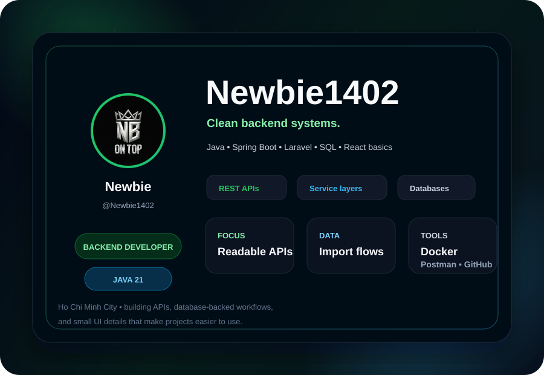

  

  
  

<!--
RepoBeats can be embedded only after generating a repo-specific image URL from https://repobeats.axiom.co/.
It requires GitHub login, so this README does not include a generic Repobeats landing-page link as an image.
-->
