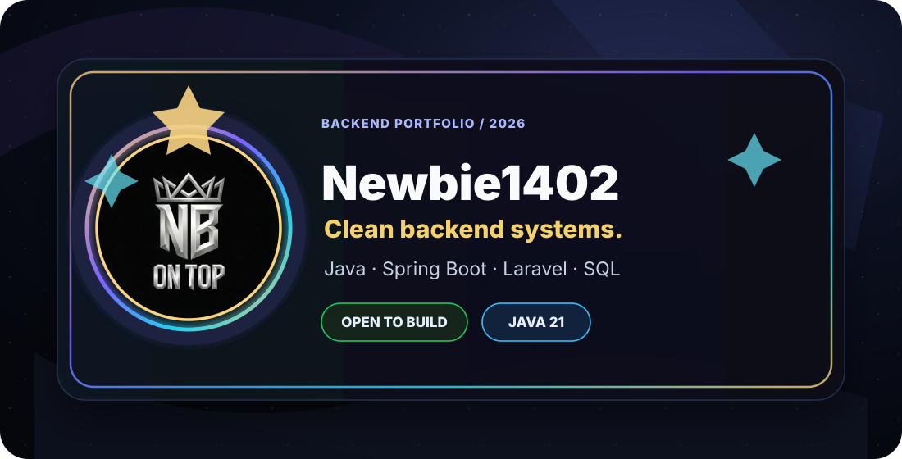

<p align="center">
  
</p>

<p align="center">
  
  
  
</p>

<p align="center">
  <b>Backend developer</b> · Java 21 · Spring Boot · Laravel · SQL · Docker · Postman
</p>

<p align="center">
  <a href="https://portfolio-fawn-kappa-66.vercel.app/">portfolio</a>
  ·
  <a href="https://github.com/Newbie1402">github</a>
  ·
  <a href="https://discordapp.com/users/577015820794855424">discord</a>
</p>

<br />

## A calm approach to complex systems

I build backend-first products with readable APIs, clear service ownership, predictable validation, and database flows that stay understandable as the feature list grows.

<table>
  <tr>
    <td width="33%"><strong>01 · API craft</strong><br /><br />REST endpoints, DTOs, validation and errors that are easy to reason about.</td>
    <td width="33%"><strong>02 · Data flow</strong><br /><br />Import, search, mapping and persistence logic where correctness matters.</td>
    <td width="33%"><strong>03 · Product detail</strong><br /><br />Small frontend touches and documentation that make software easier to use.</td>
  </tr>
</table>

<br />

## The stack I reach for

<p align="center">
  
</p>

<table>
  <tr>
    <td><strong>Backend</strong><br />Java 21 · Spring Boot · Laravel · PHP · Python</td>
    <td><strong>Data</strong><br />PostgreSQL · MySQL · MariaDB · SQL design</td>
    <td><strong>Workflow</strong><br />Docker · Postman · GitHub · JetBrains · VS Code</td>
  </tr>
</table>

<br />

## Selected builds

| Project | What it says about my work |
| --- | --- |
| [Doctor Appointment Booking System](https://github.com/Newbie1402/Doctor-Appointment-Booking-System) | Scheduling, users and business rules brought into one usable flow. |
| [Boilerplate Spring Boot](https://github.com/Newbie1402/Boilerplate_SpringBoot) | A structured starting point for APIs that need to remain maintainable. |
| [EV Battery Swap Station](https://github.com/Newbie1402/EV_Battery_SwapStation_MS) | Service boundaries and operational flows for a data-heavy domain. |
| [Service Koi](https://github.com/Newbie1402/Service-Koi) | A practical service platform with attention to the details around the core logic. |

<br />

## How I think about a feature

```text
understand the flow  ->  define ownership  ->  make the data predictable
        API contract  ->  service logic     ->  persistence + useful UI detail
```

The goal is simple: build backend-first products that are easy to extend, explain and trust later.

<br />

## Project signals

<p align="center">
  
  
</p>

<p align="center">
  
</p>

<br />

## Current direction

> Build useful software, keep the logic boring, and make the product feel considered.

<p align="center">
  <a href="https://portfolio-fawn-kappa-66.vercel.app/">See the portfolio</a>
  ·
  <a href="https://github.com/Newbie1402?tab=repositories">Browse the repositories</a>
</p>

<!-- RepoBeats is repo-specific and needs its generated URL from https://repobeats.axiom.co/. -->
